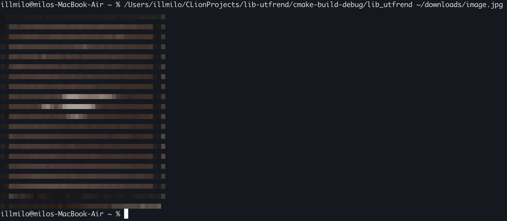

# lib-utfrend

---
A friend of yours in rendering visual media into UTF x ANSI text.

- Fast rendering due to grouped pixel reading.
- Simple usage through one header and `#define` macro.
- Use as a library for your projects.
- Use independently by rendering any video/image media with `main.cpp`.
## Screenshots

## Requirements
1. True-color-supported terminal (e. g. [iTerm2](https://iterm2.com/downloads.html)).
2. [OpenCV](https://opencv.org/releases/)
## Usage
The header file is split in two. Just use corresponding `#define` macro for your needs.
```c++
#define LIB_UTFREND_IMAGE_H
#define LIB_UTFREND_VIDEO_H
#include "lib_utfrend.h
```
---
## Contributions
Feel free to fork and contribute to this repository.
## License
This project is reserved under [MIT License](LICENSE).