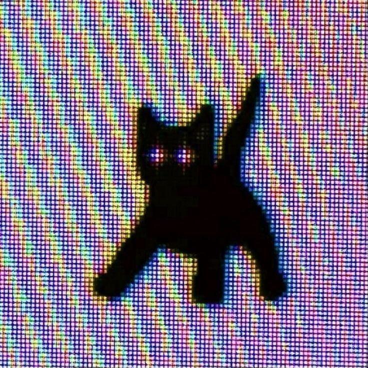
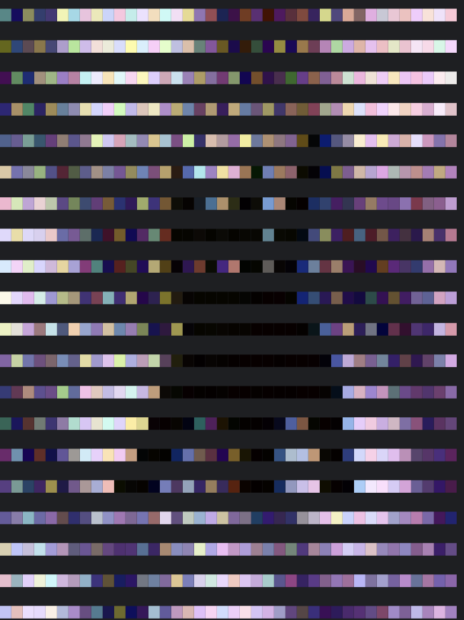

# lib-utfrend

---
Render image into UTF text.
- Fast rendering due to grouped pixel reading
- Simple usage through _just one header_
## Screenshots

<div>
</div>

## Requirements
1. True-color-supported terminal (e. g. [iTerm2](https://iterm2.com/downloads.html)).
2. [OpenCV](https://opencv.org/releases/)
## Usage
Just include the header file into your project:
```c++
#include "lib_utfrend.h
int main() {
    renderImage();
}
```
---
## Contributions
Feel free to contribute to this repository.
## License
This project is reserved under [MIT License](LICENSE).